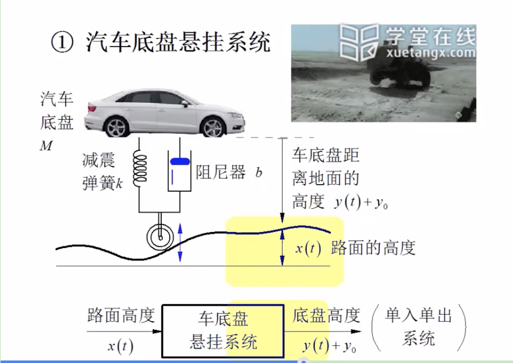
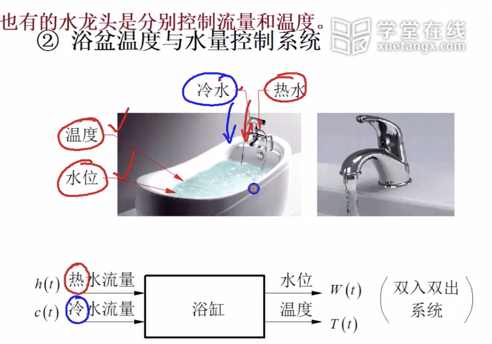
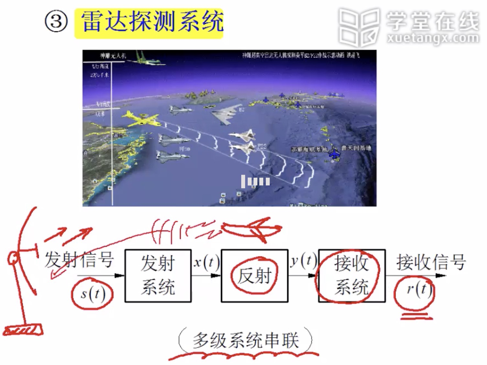
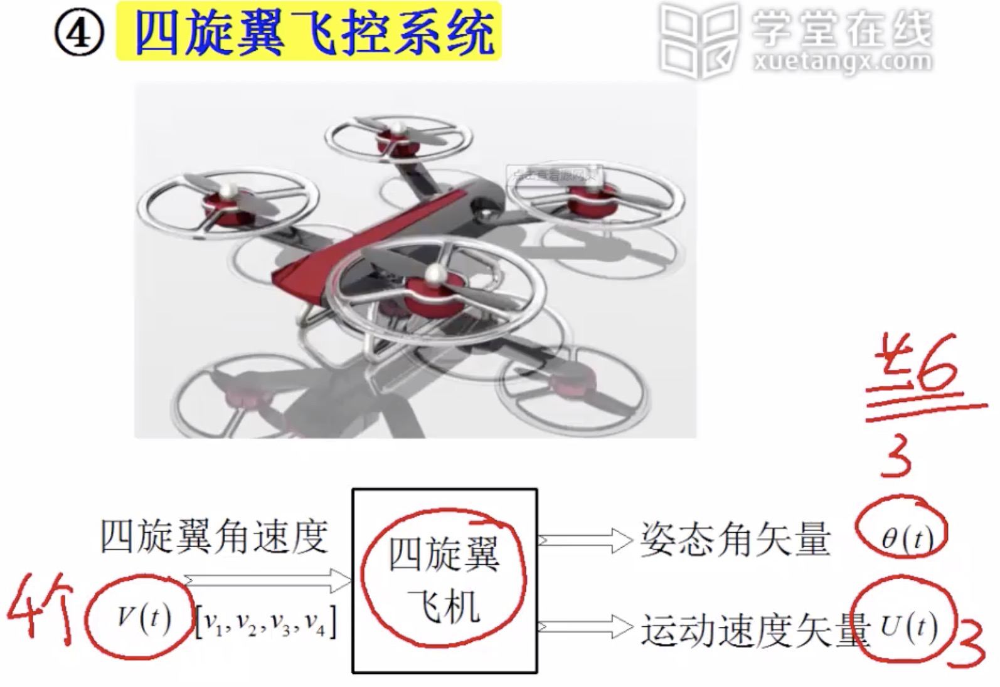
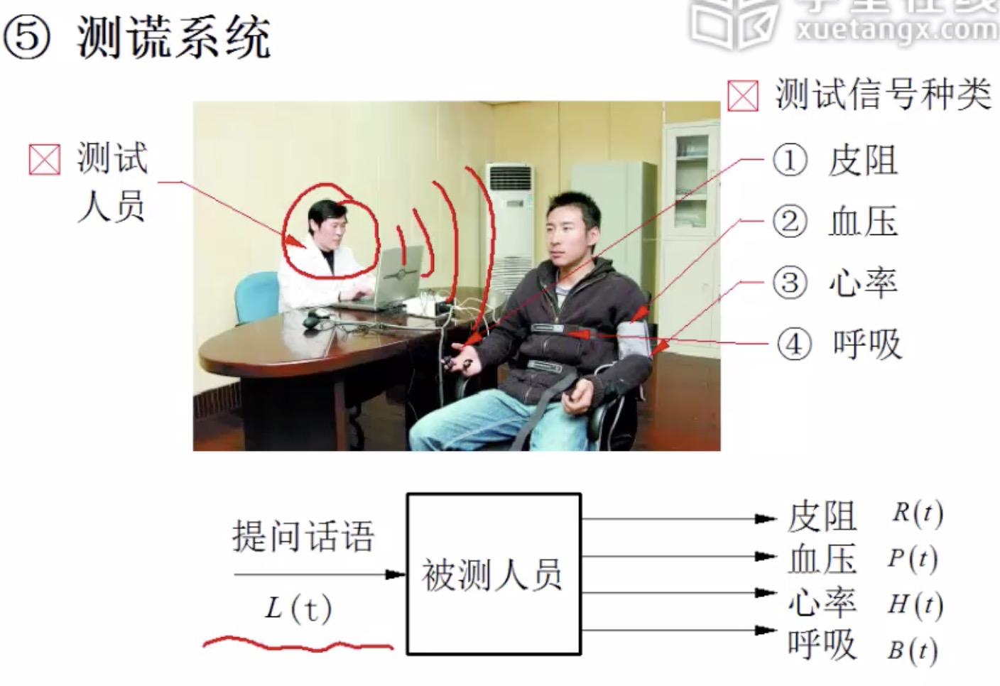
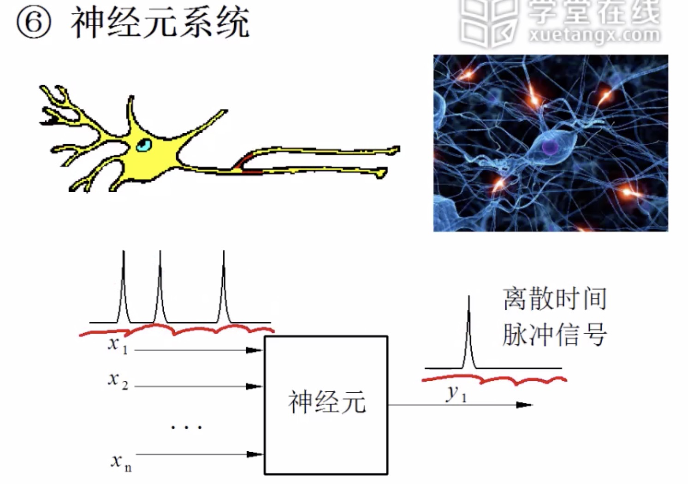
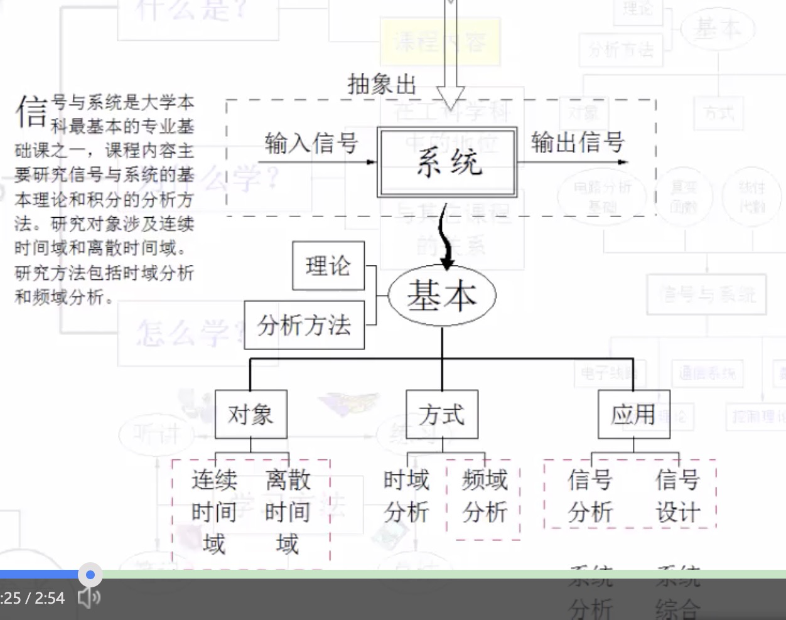

# 40250144X 信号与系统分析

## 0. 前言

### 0.0 前置知识

y(t)=e-tsin(5t)的导数，函数乘法的倒数是拆开单独求导的加和，与自变量嵌套的那种乘法区别开

下列函数与函数x(t)=sin(t)正交，即在区间(0~2π)内积等于0的函数是： 函数正交的意思是，其乘积的积分为0

高通滤波电路是将低通滤波电路和高通滤波电路进行不同组合，可获得带通滤波电路和带阻滤波电路。====》与Qualcomm无关，是高频通过的意思，但是为什么选择电感与电容的组合而不是电阻与电容的组合？？？

以下概念哪些是复变函数课程的基本概念？

- 特征向量
- 留数
- Z变换,
- - 不正确特征向量
- 解析函数 
- 围线积分

### 0.1 [什么是信号与系统](https://www.xuetangx.com/courses/course-v1:TsinghuaX+40250144X+sp/courseware/d3e621a346474aaaa541033bda85bb94/05dfeb29cf08435f9853a597526ff8c0/)

信号是传递信息的物质载体和表现形式。

###  [0.2 课程内容及其重要性](https://www.xuetangx.com/courses/course-v1:TsinghuaX+40250144X+sp/courseware/d3e621a346474aaaa541033bda85bb94/5bec6bc882e84340b1bec75b81823958/)

